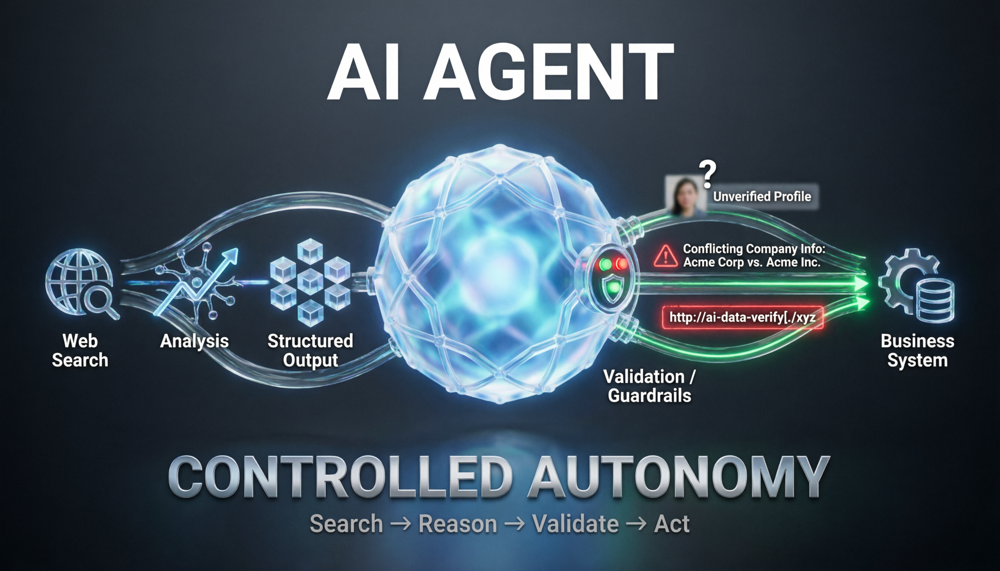
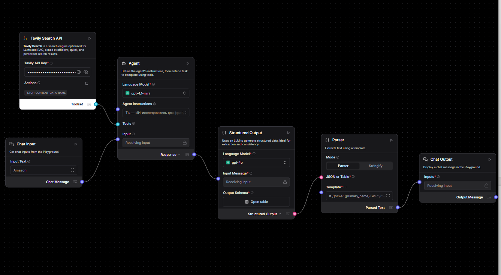

# AI-агент нашёл клиента. А потом начал выдумывать: чему меня научил MVP в LangFlow

**Andrey Semenov**
*Hypermarket Director | Operational Excellence | AI Business Transformation*

Обычная LLM отвечает на вопрос.

AI-агент может сделать больше: самостоятельно обратиться к внешнему поиску, собрать информацию, проанализировать её и вернуть структурированный результат.

Звучит как следующий уровень автоматизации.

Но во время моего последнего эксперимента я столкнулся с более интересным вопросом:

**что происходит, когда агент начинает действовать самостоятельно — и ошибается?**

Я решил проверить это на практической задаче и построил в LangFlow MVP исследовательского агента для предварительного анализа потенциального заказчика.

Именно ошибки этого MVP дали мне гораздо больше для понимания AI-архитектуры, чем его успешные ответы.

## Бизнес-задача

Представим фрилансера или небольшую B2B-команду.

Приходит новый потенциальный клиент.

Известно немного: название компании, имя, email или телефон.

Перед началом сотрудничества полезно понять:

* кто перед нами;
* чем занимается компания или специалист;
* какая у них профессиональная репутация;
* есть ли публичные сигналы риска;
* как лучше выстроить коммуникацию.

Обычно такой предварительный research выполняется вручную.

Я решил проверить, можно ли делегировать значительную часть этой работы AI-агенту.

## Почему здесь недостаточно одного промпта

Я взял за основу MarketResearchAgent в LangFlow и перестроил его под свою задачу.

Архитектура получилась достаточно простой:

**Chat Input → Agent + Tavily Search → Structured Output → Parser → Chat Output**

Но принципиально важно разделение ответственности.

Поиск отвечает за получение внешних данных.

Агент — за их анализ и принятие решения.

Structured Output — за приведение результата к фиксированной схеме.

Parser — за представление результата человеку.

На выходе получается не произвольный текст LLM, а структурированное досье из 20 полей, которое в дальнейшем можно передать в CRM или n8n.

И вот именно во время тестирования началось самое интересное.

## Ошибка №1. Агент придумал человека

Первый серьёзный тест я провёл по личному email.

Когда открытых данных оказалось мало, агент сделал то, что LLM умеют особенно хорошо:

**заполнил пробелы правдоподобной информацией.**

Появились несуществующие социальные сети, другой город и факты, которых не было в результатах поиска.

Для чат-бота это плохой ответ.

Для системы, которая составляет досье на потенциального клиента, — критическая ошибка.

Я изменил инструкции:

* нет подтверждения — ставь `null`;
* не делай выводов по косвенным признакам;
* не объединяй неподтверждённые данные;
* при нехватке информации прямо сообщай об этом.

После изменения поведения повторный тест дал уже совершенно другой результат: найденные данные были указаны, а всё неподтверждённое осталось пустым.

Первый вывод:

**хороший агент должен уметь не только искать. Он должен уметь признать, что не знает ответа.**

## Ошибка №2. Агент объединил две компании в одну

Следующий тест — компания с неоднозначным названием.

Поиск нашёл несколько организаций с одинаковым или похожим названием.

Агент аккуратно собрал информацию...

и создал из нескольких юридических лиц одну несуществующую компанию.

Это показало другую проблему агентных систем.

Каждый отдельный найденный факт может быть корректным, но итоговый вывод всё равно может оказаться ложным.

В инструкцию появилось новое правило:

**не склеивать одноимённые компании.**

Если субъект нельзя однозначно идентифицировать, агент должен сообщить о неопределённости и запросить дополнительные признаки: город, сайт или другие данные.

Второй вывод:

**качество поиска ещё не означает качество идентификации.**

## Ошибка №3. Агент придумал правильную на вид ссылку

Следующий эксперимент оказался ещё интереснее.

При исследовании человека по корпоративному email агент указал ссылку на LinkedIn.

Она выглядела абсолютно правдоподобно.

Но при проверке возвращала 404.

Модель не нашла URL.

Она его сконструировала.

После этого я добавил жёсткое правило:

**URL можно возвращать только тогда, когда он дословно присутствует в результатах поиска.**

Но эксперимент на этом не закончился.

## Одинаковая архитектура, разные модели — разное поведение

Финальный вариант я протестировал на двух моделях.

GPT-4.1 mini чаще находила конкретные факты: цифры, сделки, события.

Но даже после введённых ограничений однажды снова сгенерировала несуществующую ссылку.

GPT-4o отвечала осторожнее. Некоторые формулировки были менее конкретными, зато неподтверждённые данные чаще сопровождались оговорками, а выдуманных URL в моих тестах не появилось.

Это привело меня к важному выводу:

**выбор модели — это не только вопрос "какая модель умнее?".**

Для конкретного продукта гораздо важнее другое:

**какое поведение модели соответствует уровню риска задачи?**

В моём сценарии осторожность оказалась ценнее дополнительной конкретики.

Поэтому для MVP я оставил GPT-4o.

## Промпт начал напоминать код

Это, пожалуй, самый интересный результат эксперимента.

После каждого теста происходил один и тот же цикл:

**тест → ошибка → определение причины → изменение правила → повторный тест.**

Постепенно инструкции агента перестали быть просто описанием его роли.

Они начали выполнять функцию поведенческого слоя системы.

Появились правила классификации входа, идентификации субъекта, работы с недостаточными данными, обработки персональной информации, использования URL и разрешения неоднозначностей.

Каждое изменение можно было проверить повторным прогоном.

Именно здесь я впервые особенно отчётливо увидел:

**в агентных системах prompt engineering постепенно превращается в engineering поведения.**

## Где проходит граница MVP

Эксперимент выявил и ограничение, которое невозможно исправить ещё одним промптом.

По частным лицам в России открытый веб-поиск часто возвращает мало информации.

Значительная часть данных из Telegram, VK и других платформ либо плохо индексируется, либо требует авторизации.

Это уже не проблема модели.

И не проблема промпта.

Это ограничение источника данных.

А значит, архитектурное решение должно находиться на другом уровне: подключение дополнительных легитимных источников данных, улучшение механизмов верификации и расширение инструментов агента с соблюдением требований к приватности и обработке персональных данных.

Для меня это важный принцип:

**не каждую проблему AI-системы нужно пытаться исправить внутри LLM.**

Иногда менять нужно данные, инструменты или сам пайплайн.

## Почему я считаю это уже системой, а не запросом к LLM

В обычном сценарии пользователь отправляет промпт и получает текст.

Здесь ответственность распределена между компонентами:

**поиск → анализ → структурирование → валидация → представление.**

Результат возвращается по фиксированной JSON-схеме и потенциально может использоваться другими системами.

Поведение агента ограничено явными правилами.

Ошибки можно локализовать и исправлять на конкретном уровне архитектуры.

Именно это, на мой взгляд, и отделяет AI-функцию от AI-системы.

## Что я сделал бы следующим

Следующий этап для такого MVP — уже не усложнение агента.

Я бы начал строить вокруг него продуктовый контур.

LangFlow оставил бы как слой агентной логики, а внешний workflow перенёс бы в n8n:

**новый лид → запуск агента → исследование → валидация → запись структурированного досье в CRM.**

Затем добавил бы память по клиенту, кэширование результатов поиска и обязательную техническую проверку ссылок после генерации.

Последний пункт особенно важен.

Эксперимент показал, что инструкция «не выдумывай URL» снижает риск, но не гарантирует выполнение правила.

Если требование критично для бизнеса, его нельзя оставлять только на уровне промпта.

**Критические ограничения должны контролироваться кодом.**

## Что изменил этот эксперимент в моём понимании AI-архитектуры

Раньше я воспринимал AI-агента прежде всего как LLM, которой дали инструменты.

Теперь смотрю на него иначе.

Агентность — это не количество подключённых tools.

Это управляемая автономность.

Система должна понимать, что искать, каким данным доверять, когда остановиться, когда признать неопределённость и какие действия ей вообще разрешены.

Поэтому следующий вопрос для меня уже не:

**«Что ещё может сделать AI-агент?»**

А другой:

**«Какую автономность бизнес готов ему доверить — и какими архитектурными ограничениями эта автономность должна контролироваться?»**

И, пожалуй, именно с этого вопроса начинается переход от красивого AI-демо к системе, которой действительно можно доверить часть бизнес-процесса.

---

**А где для вас проходит граница автономности AI-агента? Какие решения вы готовы делегировать ему полностью, а какие обязательно оставили бы под контролем человека?**

*Проект реализован как учебно-исследовательский MVP. При работе с информацией о людях необходимо учитывать требования законодательства, приватности, условия использования источников и минимизацию персональных данных.*
